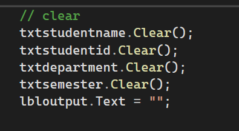

# Discouse chapter1
# image1 = clear
A simple C# Windows Forms project for entering and displaying student information.
#Features
Student Name
Student ID
Department
Semester
Clear Button
Clear Function
The Clear button removes all entered information from the textboxes and output label.
txtstudentname.Clear();
txtstudentid.Clear();
txtdepartment.Clear();
txtsemester.Clear();
lbloutput.Text = "";

# image2 = creating variables
This C# Windows Forms program collects and displays student information.
Information Used
Student Name
Student ID
Department
Semester
How It Works
The program gets data from TextBoxes, uses int.Parse() for Student ID and Semester, and displays all information in a Label.
Output
The entered student information is displayed in lbloutput.

# image3 =close using this keyword
Form Close
This C# code is used to close the current Windows Form.
Code
this.Close();
How It Works
this refers to the current form.
Close() closes the current form.
